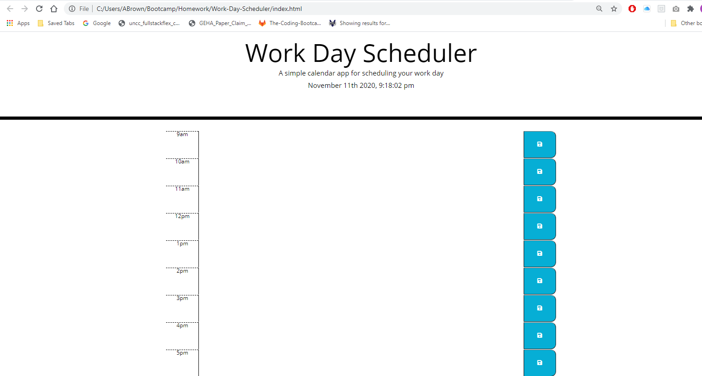

# Work-Day-Scheduler

This webpage was designed to hone jQuery skills. Through this program, the user should be able to log their activities between the hours of 9am and 5pm, by the hour. The input should then be saved to local storage for later viewing. This Work Day Scheduler would be useful for individuals to access on personal devices, to keep track of their schedule throughout the day.

## Webpage:
[Deployed Website](https://averyjbrown2.github.io/Work-Day-Scheduler/)

## Images:

